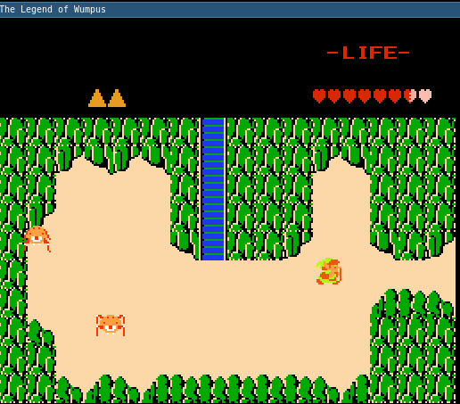
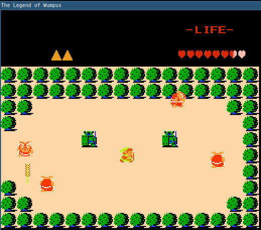

# The Legend of Wumpus
The Legend of Wumpus is a Legend of Zelda clone written entirely in Java, using only the standard libraries.  The map was taken directly from the original game and modified to make it smaller.

To run it, all you should have to do is download and execute the LegendOfWumpus.jar file.
One of the notable differences from the original game is the fact that you cannot move in any arbitrairy direction - only go forward and turn left.  (This was supposed to be a joke about how Karel the Robot can only turn left.)
Controls:
 - `w` to go forward
 - `e` to turn left
 - `q` to attack
 - `i` to toggle invincibility

As a final project for our introductory CS course, there will definitely be some bugs.  We aren't actively developing this anymore, so any bugs will be left as they were on the turn-in day.
